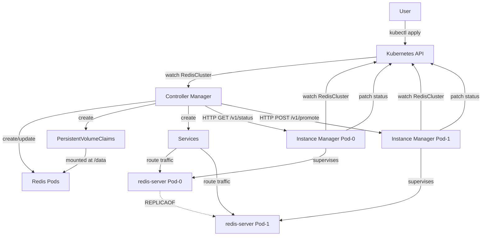

## Overview

Redis Operator uses a **split control/data plane architecture** inspired by CloudNativePG. The operator consists of two roles that share a single OCI image:

1. **Controller Manager** — Runs in the control plane, reconciles `RedisCluster` resources
2. **Instance Manager** — Runs as PID 1 inside each Redis pod, manages the local Redis process

This separation enables pod-precise control, safer failover, and flexible lifecycle management without relying on StatefulSets.

## Core Components

### Controller Manager

The controller manager (`redis-operator controller`) is a standard Kubernetes operator that:

- Reconciles `RedisCluster`, `RedisBackup`, and `RedisScheduledBackup` custom resources
- Creates and manages Pods, PVCs, Services, ConfigMaps, and RBAC resources
- Polls instance manager HTTP endpoints for live Redis status
- Orchestrates failover, rolling updates, and scaling operations
- Updates cluster status and Kubernetes conditions

**Key reconciliation steps** (executed in order):

1. **Global resources** — ServiceAccount, RBAC, ConfigMap (redis.conf template), PodDisruptionBudget
2. **Secret resolution** — Resolve all secrets referenced in `ClusterSpec`, refresh `status.secretsResourceVersion`
3. **Services** — Ensure `-leader`, `-replica`, and `-any` Services exist with correct selectors
4. **Status collection** — HTTP-poll each instance manager pod for live Redis status
5. **Status update** — Write collected data into `cluster.status`
6. **Reachability check** — Requeue if any expected instance is unreachable
7. **PVC reconciliation** — Create missing PVCs, track dangling/resizing/unusable PVCs
8. **Pod reconciliation** — Create primary, join replicas, scale up/down, rolling updates

See `internal/controller/cluster/reconciler.go` for the complete implementation.

### Instance Manager

The instance manager (`redis-operator instance`) runs inside each Redis pod and:

- Initializes the Redis data directory (fresh start or restore from backup)
- Generates `redis.conf` from the cluster ConfigMap and pod-specific parameters
- Starts and supervises `redis-server` as a child process
- Exposes an HTTP API for Kubernetes probes and operator commands
- Runs an in-pod reconcile loop that watches the `RedisCluster` CR for config changes
- Enforces split-brain prevention at boot time
- Handles live configuration updates (ACL, password rotation) without restarts

**HTTP API endpoints** (called by the controller via pod IP):

- `GET /v1/status` — Returns live Redis metrics (role, replication offset, connected replicas)
- `POST /v1/promote` — Promotes the instance to primary (`REPLICAOF NO ONE`)
- `POST /v1/backup` — Triggers an RDB/AOF backup to object storage
- `GET /healthz` — Kubernetes liveness probe with primary isolation checks
- `GET /readyz` — Kubernetes readiness probe

See `internal/instance-manager/run/run.go` and `internal/instance-manager/webserver/server.go`.

<Note>
The controller always targets specific pods by **pod IP**, not through Services. This ensures precise control for failover, promotion, and backup operations.
</Note>

## Communication Channels

### Kubernetes API (Primary)

- **Controller → Cluster**: Watches and reconciles `RedisCluster` resources
- **Instance Manager → Cluster**: Watches `RedisCluster` for configuration changes, patches `cluster.status.instancesStatus[<podName>]` with live metrics
- **Shared state**: `status.currentPrimary` is the source of truth for which pod should run as primary

### HTTP API (Secondary)

The controller calls instance manager HTTP endpoints directly via pod IP for pod-specific operations:

- **Status polling**: `GET http://<pod-ip>:9121/v1/status`
- **Promotion**: `POST http://<pod-ip>:9121/v1/promote`
- **Backup**: `POST http://<pod-ip>:9121/v1/backup`

This bypasses load-balanced Services and targets the exact pod the controller intends to operate on.

## Pod Lifecycle Management

<Warning>
Pods are **not** managed by a StatefulSet. The reconciler creates, updates, and deletes `Pod` objects directly.
</Warning>

Each pod's PVC is created separately and reused across pod restarts. When a pod spec needs updating:

1. The pod is deleted
2. A new pod is created with the same PVC
3. The instance manager detects the configuration change and regenerates `redis.conf`
4. Redis starts with the updated configuration

This approach provides:

- **Full lifecycle control**: The operator can enforce Redis-specific ordering (replicas before primary)
- **Immediate updates**: No StatefulSet immutability constraints (e.g., `volumeClaimTemplates`)
- **Precise failover**: The operator controls exactly when and how each pod is replaced

See `internal/controller/cluster/pods.go` and `internal/controller/cluster/pvcs.go`.

## Service Topology

The operator creates three Kubernetes Services for each `RedisCluster`:

| Service | Selector | Purpose |
|---------|----------|----------|
| `<cluster>-leader` | `redis.io/role: primary` | Routes to the current primary pod |
| `<cluster>-replica` | `redis.io/role: replica` | Load-balances read traffic across replicas |
| `<cluster>-any` | `redis.io/cluster: <name>` | Routes to any pod (primary or replica) |

Service selectors are **updated during failover** to point to the new primary. Applications should use:

- `<cluster>-leader` for write operations
- `<cluster>-replica` for read-only operations
- `<cluster>-any` for workloads that can tolerate reading from any instance

See `internal/controller/cluster/services.go`.

## Secret Injection

All secrets (`authSecret`, `aclConfigSecret`, `tlsSecret`, `caSecret`, `backupCredentialsSecret`) are injected as **projected volumes**, never as environment variables.

**Projection paths** inside pods:

- `/projected/password` — Redis password (from `authSecret`)
- `/projected/acl` — ACL rules (from `aclConfigSecret`)
- `/tls/tls.crt`, `/tls/tls.key` — TLS certificate and key (from `tlsSecret`)
- `/tls/ca.crt` — CA certificate (from `caSecret`)

**Secret rotation workflow**:

1. User updates the referenced `Secret` in Kubernetes
2. Kubernetes automatically updates the projected volume content inside running pods
3. The instance manager reconciler detects the new file content
4. The instance manager applies changes live via `CONFIG SET` or `ACL LOAD` (no pod restart)

<Info>
The controller tracks each secret's `ResourceVersion` in `status.secretsResourceVersion`. When a secret changes, the controller enqueues the cluster for reconciliation.
</Info>

See `internal/controller/cluster/secrets.go` and `internal/instance-manager/reconciler/reconciler.go`.

## PodDisruptionBudget

The operator creates a `PodDisruptionBudget` for every `RedisCluster` where `spec.enablePodDisruptionBudget` is `true` (the default).

**PDB configuration**:

- `minAvailable = max(1, spec.instances - 1)`
- Allows at most **one pod** to be voluntarily disrupted at a time
- Updated automatically when `spec.instances` changes

<Note>
During rolling updates, the operator respects the PDB by updating replicas first (highest ordinal) and the primary last via switchover.
</Note>

See `internal/controller/cluster/pdb.go`.

## Diagram

## Key Design Decisions

| Decision | Rationale |
|----------|----------|
| No StatefulSets | Full lifecycle control, no immutability constraints, Redis-specific ordering |
| Split control/data plane | Pod-precise control, safer failover, live configuration updates |
| Pod IP targeting | Avoid load-balancer unpredictability for critical operations |
| Projected volume secrets | Enable secret rotation without pod restarts, better security posture |
| Direct Pod/PVC management | Enforce replica-first rolling updates, primary switchover, fencing |
| Map-based status | Avoid strategic-merge-patch ordering issues, stable per-pod tracking |

See [Design Principles](/concepts/design-principles) for the full philosophy.