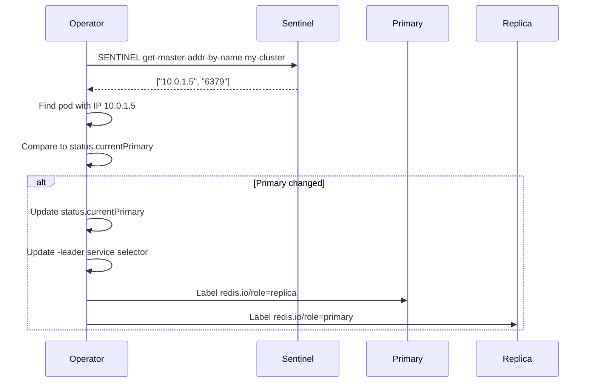

Redis Sentinel provides automatic failover for Redis replication clusters. When enabled, the operator deploys a separate set of Sentinel pods that monitor the data pods and elect a new primary if the current primary fails.

## Overview

Sentinel mode adds:
- **Automatic failover**: Sentinel elects a new primary when the current primary is unreachable
- **Service discovery**: Clients query Sentinel for the current primary endpoint
- **Split-brain prevention**: Quorum-based election prevents dual primaries

**Architecture**:
```
┌─────────────────┐
│ Sentinel Pods   │
│ (3 instances)   │
│ Port 26379      │
└────────┬────────┘
         │ Monitors
         ▼
┌─────────────────┐
│ Data Pods       │
│ my-cluster-0    │ ← Primary
│ my-cluster-1    │ ← Replica
│ my-cluster-2    │ ← Replica
└─────────────────┘
```

## Configuration

Enable Sentinel mode by setting `spec.mode: sentinel`:

```yaml
apiVersion: redis.io/v1
kind: RedisCluster
metadata:
  name: my-cluster
spec:
  instances: 3
  mode: sentinel  # Enables Sentinel
  storage:
    size: 10Gi
```

### Sentinel Defaults

From `api/v1/rediscluster_types.go:82-87`:

```go
const (
    SentinelPort      = 26379
    SentinelInstances = 3
    SentinelQuorum    = 2
)
```

- **Port**: 26379 (standard Sentinel port)
- **Instances**: 3 (fixed, cannot be changed)
- **Quorum**: 2 (majority of 3)

## How It Works

### Sentinel Pod Lifecycle

1. **Creation**: When `mode: sentinel`, the operator creates 3 Sentinel pods
   - Pod names: `<cluster-name>-sentinel-0`, `<cluster-name>-sentinel-1`, `<cluster-name>-sentinel-2`
   - Labels: `redis.io/workload=sentinel`, `redis.io/cluster=<cluster-name>`

2. **Monitoring**: Each Sentinel pod monitors the data pods
   - Runs `SENTINEL MONITOR <cluster-name> <primary-ip> 6379 2`
   - Tracks primary and replicas
   - Performs health checks (ping every 1s)

3. **Failover**: On primary failure:
   - Sentinels detect primary is unreachable (30s timeout)
   - Quorum vote elects new primary (2/3 Sentinels must agree)
   - Sentinel issues `REPLICAOF NO ONE` to new primary
   - Other replicas reconfigured to follow new primary

4. **Operator Sync**: Operator queries Sentinel for current primary
   - Updates `status.currentPrimary`
   - Updates `-leader` service selector
   - Updates pod role labels

See `internal/controller/cluster/sentinel.go:20-97` for implementation.

### Primary Discovery

The operator queries Sentinel to discover the current primary:

```go
func querySentinelMaster(
    ctx context.Context,
    sentinelAddr string,
    masterName string,
) (host string, port int, err error) {
    redisClient := redis.NewClient(&redis.Options{
        Addr: sentinelAddr,
    })
    defer redisClient.Close()
    
    // SENTINEL get-master-addr-by-name <cluster-name>
    resp, err := redisClient.Do(
        ctx,
        "SENTINEL",
        "get-master-addr-by-name",
        masterName,
    ).Result()
    
    // Response: ["<host>", "<port>"]
    values := resp.([]interface{})
    host = values[0].(string)
    port, _ = strconv.Atoi(values[1].(string))
    return host, port, nil
}
```

See `sentinel.go:144-174`.

### Reconciliation Flow



See `sentinel.go:20-97` for `reconcileSentinelMaster()`.

## Client Configuration

Clients must use Sentinel-aware libraries.

### Redis Sentinel Service

The operator creates a service for Sentinel pods:

```yaml
apiVersion: v1
kind: Service
metadata:
  name: my-cluster-sentinel
spec:
  selector:
    redis.io/cluster: my-cluster
    redis.io/workload: sentinel
  ports:
    - port: 26379
      targetPort: 26379
      name: sentinel
  type: ClusterIP
```

### Client Examples

**Go** (go-redis):
```go
import "github.com/redis/go-redis/v9"

client := redis.NewFailoverClient(&redis.FailoverOptions{
    MasterName:    "my-cluster",
    SentinelAddrs: []string{
        "my-cluster-sentinel.default.svc.cluster.local:26379",
    },
    Password: os.Getenv("REDIS_PASSWORD"),
})
```

**Python** (redis-py):
```python
from redis.sentinel import Sentinel

sentinel = Sentinel(
    [('my-cluster-sentinel.default.svc.cluster.local', 26379)],
    socket_timeout=0.1
)

master = sentinel.master_for(
    'my-cluster',
    password=os.getenv('REDIS_PASSWORD'),
    socket_timeout=0.1
)

master.set('foo', 'bar')
```

**Java** (Jedis):
```java
import redis.clients.jedis.JedisSentinelPool;

Set<String> sentinels = new HashSet<>();
sentinels.add("my-cluster-sentinel.default.svc.cluster.local:26379");

JedisSentinelPool pool = new JedisSentinelPool(
    "my-cluster",
    sentinels,
    password
);

Jedis jedis = pool.getResource();
jedis.set("foo", "bar");
```

**Node.js** (ioredis):
```javascript
const Redis = require('ioredis');

const redis = new Redis({
  sentinels: [
    { host: 'my-cluster-sentinel.default.svc.cluster.local', port: 26379 }
  ],
  name: 'my-cluster',
  password: process.env.REDIS_PASSWORD
});

redis.set('foo', 'bar');
```

## Failover Behavior

### Automatic Failover

**Scenario**: Primary pod crashes

1. **Detection**: Sentinels detect primary unreachable after 30s (3 failed pings)
2. **Vote**: Sentinels vote to elect new primary (quorum=2/3)
3. **Promotion**: Sentinel issues `REPLICAOF NO ONE` to elected replica
4. **Reconfiguration**: Other replicas reconfigured to follow new primary
5. **Operator Sync**: Operator queries Sentinel, updates status and services

**Timeline**:
- T+0s: Primary crashes
- T+30s: Sentinels detect failure
- T+35s: Quorum vote completes, new primary elected
- T+40s: Operator queries Sentinel, updates status
- T+45s: All replicas following new primary

**Events**:
```bash
$ kubectl describe rediscluster my-cluster
Events:
  Type    Reason            Message
  ----    ------            -------
  Normal  SentinelFailover  Sentinel promoted my-cluster-1 (former primary: my-cluster-0)
```

### Manual Failover

Trigger failover via Sentinel:

```bash
# Connect to any Sentinel pod
kubectl exec -it my-cluster-sentinel-0 -- redis-cli -p 26379

# Trigger failover
SENTINEL FAILOVER my-cluster
```

Operator detects the change within 10s (reconciliation interval).

### Recovery After Network Partition

**Scenario**: Primary is network-isolated but still running

1. Sentinels cannot reach primary → elect new primary
2. Old primary continues accepting writes (split-brain risk)
3. When network heals:
   - Sentinel detects old primary
   - Issues `REPLICAOF <new-primary-ip> 6379`
   - Old primary demoted to replica
   - Conflicting writes lost (last-write-wins)

**Mitigation**: Use `primaryIsolation` to prevent split-brain:

```yaml
spec:
  mode: sentinel
  primaryIsolation:
    enabled: true  # Primary fails liveness probe if isolated
    apiServerTimeout: 5s
    peerTimeout: 5s
```

See [Primary Isolation](./cluster-spec#high-availability) for details.

## Status Fields

<ParamField path="status.sentinelReadyInstances" type="int32">
  Count of Sentinel pods passing readiness probes.
  
  ```yaml
  status:
    sentinelReadyInstances: 3
  ```
</ParamField>

<ParamField path="status.currentPrimary" type="string">
  Pod name of the current primary as reported by Sentinel.
  
  ```yaml
  status:
    currentPrimary: my-cluster-1
  ```
</ParamField>

## Advanced Configuration

### Custom Sentinel Config

Sentinel configuration is managed by the operator. The following parameters are set:

```conf
sentinel monitor my-cluster <primary-ip> 6379 2
sentinel down-after-milliseconds my-cluster 30000
sentinel parallel-syncs my-cluster 1
sentinel failover-timeout my-cluster 180000
```

These are **not user-configurable** in the current version.

### Sentinel with TLS

If `spec.tlsSecret` is set, Sentinel pods are configured with TLS:

```yaml
spec:
  mode: sentinel
  tlsSecret:
    name: redis-tls
```

Clients must connect to Sentinel with TLS:

```go
client := redis.NewFailoverClient(&redis.FailoverOptions{
    MasterName:    "my-cluster",
    SentinelAddrs: []string{"my-cluster-sentinel.default.svc.cluster.local:26379"},
    TLSConfig: &tls.Config{
        RootCAs: caCertPool,
    },
})
```

### Sentinel with ACLs

Sentinel does **not** support ACLs in Redis 7.2. Use `spec.authSecret` for password-based auth:

```yaml
spec:
  mode: sentinel
  authSecret:
    name: redis-password
```

Sentinel and data pods share the same password.

## Best Practices

### Use Sentinel for production HA

Standalone mode requires manual intervention during primary failure. Sentinel mode provides automatic recovery.

**Comparison**:

| Feature | Standalone | Sentinel |
|---------|------------|----------|
| Automatic failover | ❌ | ✅ |
| Manual failover | Via annotation | Via Sentinel |
| Client discovery | Static service | Sentinel query |
| Downtime on failure | Minutes | ~30-45 seconds |

### Deploy 3 or 5 Sentinels (odd number)

Current version deploys exactly 3 Sentinels (hardcoded). For higher availability, you could run multiple RedisCluster resources with Sentinel in different clusters and use cross-cluster replication.

### Set minSyncReplicas to prevent data loss

```yaml
spec:
  mode: sentinel
  minSyncReplicas: 1  # Primary requires 1 replica ACK before write succeeds
```

This ensures at least 1 replica has the data before the write is acknowledged, reducing data loss during failover.

### Monitor Sentinel health

Check Sentinel status:

```bash
kubectl exec my-cluster-sentinel-0 -- redis-cli -p 26379 SENTINEL MASTER my-cluster
kubectl exec my-cluster-sentinel-0 -- redis-cli -p 26379 SENTINEL REPLICAS my-cluster
kubectl exec my-cluster-sentinel-0 -- redis-cli -p 26379 SENTINEL SENTINELS my-cluster
```

Alert on `status.sentinelReadyInstances < 2` (lost quorum).

### Use pod anti-affinity for Sentinel pods

Ensure Sentinel pods are on different nodes:

```yaml
spec:
  mode: sentinel
  affinity:
    podAntiAffinity:
      requiredDuringSchedulingIgnoredDuringExecution:
        - labelSelector:
            matchLabels:
              redis.io/cluster: my-cluster
          topologyKey: kubernetes.io/hostname
```

This applies to **both** data and Sentinel pods.

## Troubleshooting

### Sentinel pods not starting

**Symptom**:
```bash
$ kubectl get pods -l redis.io/workload=sentinel
NAME                   READY   STATUS    RESTARTS   AGE
my-cluster-sentinel-0   0/1     Pending   0          5m
```

**Cause**: Same scheduling constraints as data pods (affinity, tolerations).

**Debug**:
```bash
kubectl describe pod my-cluster-sentinel-0
```

**Fix**: Ensure sufficient nodes for both data and Sentinel pods (6 nodes for 3 data + 3 Sentinel with hard anti-affinity).

### Failover not triggering

**Symptom**: Primary pod deleted but Sentinel doesn't elect new primary.

**Debug**:
```bash
# Check Sentinel view of primary
kubectl exec my-cluster-sentinel-0 -- redis-cli -p 26379 SENTINEL MASTER my-cluster | grep -E "(flags|num-other-sentinels)"

# Expected output:
# flags: master
# num-other-sentinels: 2
```

**Causes**:
1. **Lost quorum**: < 2 Sentinels running
2. **Network partition**: Sentinels can't reach each other
3. **Wrong master name**: Sentinel monitoring different name

**Fix**:
```bash
# Verify Sentinel count
kubectl get pods -l redis.io/workload=sentinel

# Check Sentinel logs
kubectl logs my-cluster-sentinel-0
```

### Sentinel reports wrong primary

**Symptom**: `status.currentPrimary` doesn't match actual primary.

**Debug**:
```bash
# Query Sentinel
kubectl exec my-cluster-sentinel-0 -- redis-cli -p 26379 SENTINEL get-master-addr-by-name my-cluster

# Query actual pods
for i in 0 1 2; do
  echo "Pod $i:"
  kubectl exec my-cluster-$i -- redis-cli INFO replication | grep role
done
```

**Fix**: Operator syncs every 10s. Wait for next reconciliation or manually trigger:
```bash
kubectl annotate rediscluster my-cluster force-sync="$(date)"
```

### Split-brain after network partition

**Symptom**: Two pods both think they're primary.

**Prevention**: Enable `primaryIsolation`:

```yaml
spec:
  mode: sentinel
  primaryIsolation:
    enabled: true
```

This prevents isolated primary from accepting writes.

**Recovery**:
```bash
# Force resync from Sentinel
kubectl delete pod my-cluster-0  # Old primary
kubectl delete pod my-cluster-sentinel-0 my-cluster-sentinel-1 my-cluster-sentinel-2
```

Sentinel re-election will establish single primary.
